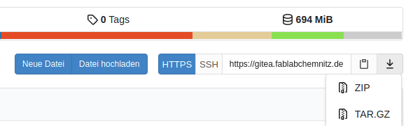
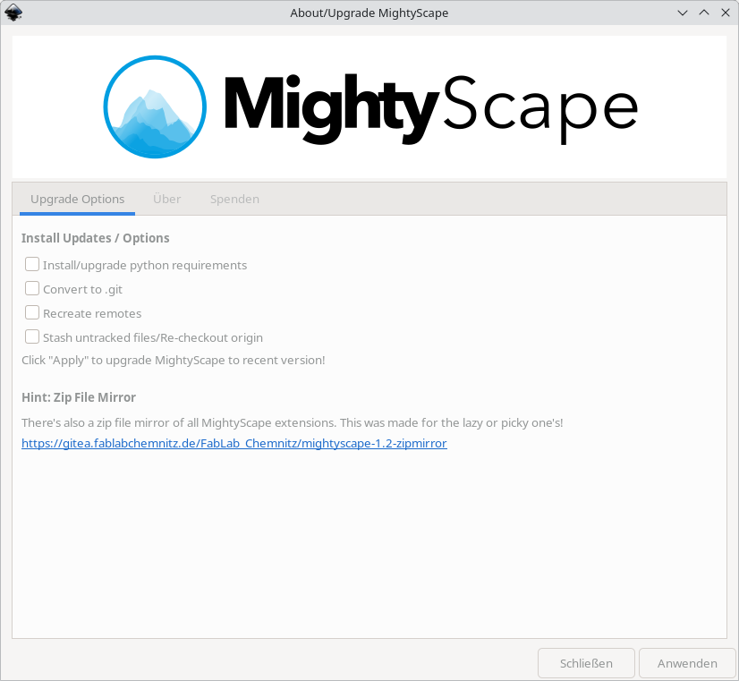

# MightyScape for Inkscape


In short: A maintained extension collection for Inkscape. There are **241 extension folders** with **479 .inx files** inside. We also take part at the official [Inkscape Extensions Gallery](https://inkscape.org/gallery/=extension/) (with single extension uploads).

# About MightyScape

Looking to get more productive we started using some more special Inkscape extensions. We love Inkscape. And we love things like 3d printing, laser cutting, vinyl cutting, pen plotting, maths, physics, geometry, patterns, 2D drawings, 3D CAD, embroidery and more stuff. All this you can do with Inkscape! We recognized that there is no good source to pull extensions in a quick and clean way. Each developer puts his own code on his hidden/unknown repository and often without enough documentation or visible results for common understanding. Many plugins are completely unknown that way, and a lot of extensions are forked x times or are unmaintained. So many of them do not work with recent Inkscape or were never tested with newer versions so far.

MightyScape's aim is to provide support for the most recent Inkscape versions only. It's not the general target to support all older systems because there are too much things to maintain simultaneously: changes in operating systems, Python, Python modules, Inkscape and other external dependencies. It's not worth to make spaghetti code to keep everyting working on all versions!

> [!NOTE]
> **The naming** "mightyscape-1.2" is from a time where Inkscape had very less releases per year and previously there were older mightyscape repositories, which are archived now. Time is going on and the Inkscape developers are releasing more frequently. Nowadays, the versioning of MightyScape stalls and will not increase by newly created git repositories with higher version number in it's project name.

# What and why?

This is a one-to-bundle-them-all collection of hundreds of additional functions to Inkscape (extensions) for the new Python 3 based version 1.X including documentation, made for makers and artists. All plugins where sorted into custom categories  (to avoid overloading the standard extension menu of Inkscape). You can find most of them in sub menu "FabLab Chemnitz". We renamed and cleaned a lot of `*.inx` files and `*.py` files. We applied some function renamings, id changes (for preferences.xml clean-keeping), spelling fixes, formattings and parameter corrections.

It took years to search and find all them on the web (so much different possible sources where to find!), to read, to comment (report issues), to fix problems, to test, to document and to provide them online. Many extensions were nearly lost in translation.

At least this repo will help to bring alife some good things and will show hidden gold. It meshes things together in a fresh and bundled way - with ease of use and minimum installation stress. A lot of code is not at the optimum. A mass of bugs has to be fixed and different tools should be improved in usage generally. This package will show errors more quickly. So hopefully a lot of new code fixes is result from this package. Maybe some people help to make all the stuff compatible with the most recent Inkscape.

# Licensing and credits

- This is not a repository to steal the work of others. The credits go to each developer, maintainer, commiter, issue reporter and so on. Please have a look at the meta.json in each directory to get information about licenses and authors for each extension.
- All plugins are open source licensed and are GNU GPL compatible. See https://www.gnu.org/licenses/license-list.html#GPLCompatibleLicenses for more details.
- All plugins were taken from each git repo's master branch (if git/svn available). There might exist some development branches, fork branches or issue comments which might resolve some issues or enhance functionality of provided plugins. To check for recent github forks use https://techgaun.github.io
- A mass of plugins were fixed by ourselves in countless hours
- Credits for creation of the MightyScape project: Mario Voigt / FabLab Chemnitz

# Tested environments

- Kubuntu 42: Inkscape 1.4.2 (1:1.4.2+202505120737+ebf0e940d0) @ Python 3.12.3 (main, Aug 14 2025, 17:47:21) [GCC 13.3.0]
- Windows 11 (@KVM/QEMU): Inkscape 1.3.2 (091e20ef0f, 2024-04-26) @ 3.13.5 (tags/v3.13.5:6cb20a2, Jun 11 2025, 16:15:46) [MSC v.1943 64 bit (AMD64)]

Some commands to get versions:
```
cat /etc/os-release
inkscape --version
python --version
python -m pip list
```

# Structure

The structure of this repo is intended to be easy. MightyScape does not work with any releases or feature branches. Just copy the complete MightyScape folder (or the particular folders you want) to your Inkscape's extension directory. 

> [!WARNING]
> We know that this repo contains unsecure executable files! You will find redundancies in this repo like node.exe (NodeJS). We did it this way to give easy possibilty to only pick the extensions you want. 

# Installation

> [!WARNING]
> Please read this first before opening issues!
> This documentation does not maintain any progressive information about installing or handling Inkscape itself.
> Depending to the operating system and the installed modules the all-over size of MightyScape is around 2 GB (which is sadly very much).

## Unsupported Inkscape versions

- **Linux**
  - MightyScape does not support the snap version and also no [AppImage]([https://inkscape.org/release/inkscape-dev/gnulinux/appimage/dl](https://inkscape.org/release/inkscape-dev/gnulinux/appimage/dl/)) version of Inkscape. 
    - The **snap** edition comes with restrictions, letting a lot of extensions fail to work. The reason is missing access to external Python interpreters. Libraries like `openmesh` or `pyclipper` cannot be used this way. 
    - The **AppImage** version will fail for a lot extension too, because subprocesses from the AppImage have no acccess to `/tmp` directory. 
    - **Flatpak** is not tested at all. Possible permission fixed might be obercome with [Flatseal](https://flathub.org/apps/com.github.tchx84.Flatseal).
    - You can still install MightyScape with snap or AppImage version but beware to get different errors.
    - Feel free to contribute solutions to address these issues. 
- **Windows**
  - Windows App Store (this was not tested yet)
- **MacOS**
  - this was never tested. We are sorry!

## Supported Inkscape versions

- **[Windows](https://inkscape.org/release)**
  - portable
  - regular installation with MSI Setup
- **Linux**
  - regular installation from package manager like dnf/yum or apt (see [here](https://wiki.inkscape.org/wiki/Installing_Inkscape))
  - **Ubuntu/Kubuntu**
    - `sudo add-apt-repository universe`
    - `sudo add-apt-repository ppa:inkscape.dev/stable` for stable releases or `sudo add-apt-repository ppa:inkscape.dev/trunk` for develop trunk
    - `sudo apt install inkscape`
  - **Fedora/CentOS**
    - `sudo dnf install inkscape`

## Installation dirs (overview)

There are two places where Inkscape extensions can be located by default, either install (global) directory or user directory. We usually put the extensions in the user's data directory, because if we would put it to the installation folder of Inkscape, we would risk deletion by upgrading. If we put them to the user directory we do not lose them.

| OS                     | user directory                                 | global directory                        |
| ---------------------- | ---------------------------------------------- | --------------------------------------- |
| Linux (Ubuntu, Fedora) | `/home/$(whoami)/.config/inkscape/extensions/` | `/usr/share/inkscape/extensions/`       |
| Windows                | `%AppData%\inkscape\extensions\`               | `C:\Program Files\inkscape\extensions\` |

Please also refer to the [official documentation](https://inkscape-manuals.readthedocs.io/en/latest/extensions.html#installing-extensions).

## Installation of prerequisites

### Git

On Linux, git usually defaults to be installed. On Windows we need to install it. Git is required to install some of the required Python modules. Please visit https://git-scm.com/downloads/win.

### Python

MightyScape heavily relies on a Python interpreter. As we need to install external dependencies (Python modules, partially with C bindings), we cannot stick to the bundled msys2 Python version, which comes with Inkscape. So we need to use a **virtualenv** on Linux or Windows. [Here](https://gitlab.com/inkscape/inkscape/-/blob/master/buildtools/msys2installdeps.sh?ref_type=heads) you can find a list of default modules Inkscape is shipped with.

> [!NOTE]
> **Linux**: Python is installed by default, so you don't have to do anything special except setting up a virtualenv (see next chapter). 

> [!NOTE]
> **Windows**: We need to install Pyhon separately. You can download it from https://www.python.org/downloads/windows/. After installation please review for correct environment variable adjustments. The command `py` or `python` has to be in `%PATH%` to be called by cmd (terminal).

### Additional Python modules

The following extra libraries are required for some of the extensions within the MightyScape package. Those are listed in our [requirements.txt](https://gitea.fablabchemnitz.de/FabLab_Chemnitz/mightyscape-1.2/requirements.txt) file. We are installing them together with MightyScape in the next section.

## Installation of MightyScape - way 1: installer (preferred way)

> [!TIP]
> **New:** We provide an all-in-one installer for Linux and Windows. Just use the following commands.

**Linux**
```
curl -s -L https://y.stadtfabrikanten.org/mightyscape-linux | bash
```

This redirects to https://raw.githubusercontent.com/eridur-de/mightyscape-1.2/refs/heads/master/mightyscape-install.sh

**Windows**
```
curl -s -L https://y.stadtfabrikanten.org/mightyscape-windows > %TEMP%\mightyscape-install.cmd & %TEMP%\mightyscape-install.cmd
```

This redirects to https://raw.githubusercontent.com/eridur-de/mightyscape-1.2/refs/heads/master/mightyscape-install.cmd

> [!NOTE]
> **Note:** The installer might prompt for system reboot. In this case please re-run the installer to continue.

> [!NOTE]
> **Note:** if `openmesh` fails to install on Windows, please see [here](https://github.com/eridur-de/mightyscape-1.2/issues/131).

## Installation of MightyScape - way 2: zip archives (mirrors)

You can also download the whole git project as `.zip` or `.tar.gz` bundled archive from https://gitea.fablabchemnitz.de/FabLab_Chemnitz/mightyscape-1.2. You can convert that directory to work with git later on, using our central [upgrade extension](https://gitea.fablabchemnitz.de/FabLab_Chemnitz/mightyscape-1.2/src/branch/master/extensions/fablabchemnitz/about_upgrade_mightyscape).

> [!NOTE]
> **Please note:** for installing Python modules you still need to install `Git for Windows`, if you are on Windows.

The **Download** buttons can be found here:

 

## Installation of MightyScape - way 3: only some parts

If you only want to download single parts of MightyScape, use one of the following mirrors:

- https://gitea.fablabchemnitz.de/FabLab_Chemnitz/mightyscape-1.2-zipmirror
- https://github.com/eridur-de/mightyscape-1.2-zipmirror

You should put the extracted files into your Inkscape user extension directory (see table at the beginning).

## Adjusting the Python interpreter of Inkscape (required)

As we use non-default Python, we need to adjust the main configuration of Inkscape to apply this change by adding a custom `python-interpreter` command in Inkscape default configuration (`preferences.xml`).

> [!INFO]
> Our installer script applies this change for you automatically! But you can dot it manually!

> [!WARNING]
> The interpreter's path **must be absolute**. Relative paths will fail!

**On Linux this might look like:**

```
vim /home/$(whoami)/.config/inkscape/preferences.xml
```
```
  <group
     id="extensions"
     python-interpreter="/home/youruser/.config/inkscape/extensions/mightyscape-1.2/venv/bin/python3"
```


**On Windows this might look like:**

```
notepad %appdata%\inkscape\preferences.xml
```
```
  <group
     id="extensions"
     python-interpreter="C:\Users\youruser\AppData\Roaming\inkscape\extensions\mightyscape-1.2\venv\Scripts\pythonw.exe"
```

> [!TIP]
> If you get a nasty popup window within Inkscape each time you are executing an extension, please double check if you really use `pythonw.exe`. Do **not** use `python.exe`.

> [!WARNING]
> Our custom Python environment on Windows will make the official Inkscape Extensions Manager impossible to run. The reason is the library `pygobject`.

# Upgrading 

## Upgrading MightyScape

There are two ways to upgrade MightyScape. Choose from:

1. If you installed MightyScape using `git clone`, just go to the git directory and run `git pull` or use the extension `About/Upgrade MightyScape`, which can be found in `Extensions` → `FabLab Chemnitz`:


2. If you previously downloaded a bulk zip file from github or gitea, just replace the content of the containing folder with the new files.

## Upgrading Python modules

Sometimes it can be helpful to install missing or upgrade Python modules. You can use our `About/Upgrade MightyScape` extension to do this, or just execute manually:

**Linux**
```
sed '/^#/d' /home/$(whoami)/.config/inkscape/extensions/mightyscape-1.2/requirements.txt | xargs -n 1 /home/$(whoami)/.config/inkscape/extensions/mightyscape-1.2/venv/bin/pip install --upgrade
```
**Windows**
```
cd %AppData%\inkscape\extensions\mightyscape-1.2\ & FOR /F %k in ('findstr /V "#" requirements.txt') DO ( py -m pip install --upgrade %k )
```

# Issues, questions, documentation, examples

This repo has two remotes:

- https://gitea.fablabchemnitz.de/FabLab_Chemnitz/mightyscape-1.2 (root repo origin from our organization)
- https://github.com/eridur-de/mightyscape-1.2 (repo for **public collaboration**) 

You can create your issues and questions **[here](https://github.com/eridur-de/mightyscape-1.2/issues)**.

> [!TIP]
> You find a lot of documentation at the sub pages of https://y.stadtfabrikanten.org/mightyscape-overview. Please have a look there first (make use of the search function).

# Donate to keep alive!


We are the [Stadtfabrikanten e.V.](https://stadtfabrikanten.org), running the FabLab Chemnitz since 2016. A FabLab is an open workshop that gives people access to machines and digital tools like 3D printers, laser cutters and CNC milling machines.

You like our work and want to support us? Each penny helps us to keep this project alive. You can donate to our non-profit organization by [different ways](https://y.stadtfabrikanten.org/donate).

You can also directly support the developers:
- [buymeacoffee.com/vmario89](https://buymeacoffee.com/vmario89)
- [github.com/sponsors/vmario89](https://github.com/sponsors/vmario89)
- [ko-fi.com/vmario89](https://ko-fi.com/vmario89)

Please also support the [Inkscape developers](https://inkscape.org/support-us/donate/) as well!

# Share

Spread and share MightyScape to Inkscape users and empower them by ...

**QR Code**


**Links**

- https://y.stadtfabrikanten.org/mightyscape.qr
- https://y.stadtfabrikanten.org/mightyscape
- https://y.stadtfabrikanten.org/mightyscape-overview

# Thanks for using our extension and helping us!
